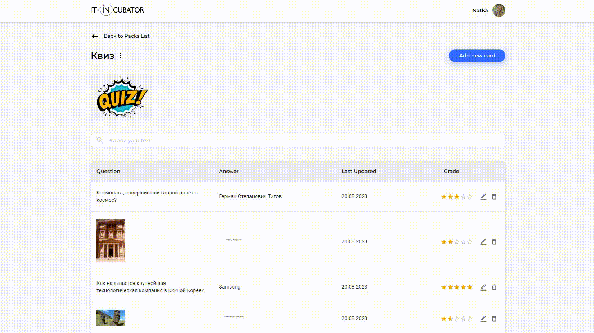

<h1 align="center">Flashcards</h1>

<h2 align="center"><a  href="https://natali-khm.github.io/rtk-cards">Live Demo</a></h2>

## Description

This app lets you learn flashcards very efficiently by showing them just before you would forget. Because you create your own flashcards, you can use it to help you remember vocabulary words, capitals, important dates, and other facts. Create your own flashcards and study sets or choose from hundreds created by other students - it's up to you.

## About the project

- The Flashcards are implemented on React with TypeScript.
- Redux Toolkit for app state management.
- Material-UI for styling.
- React Hook Form for form state management and validation.
- Axios for ajax-requests.